In this script we define two populations in a dataset of physical an
sedimentological properties of different earthquake and flood turbidites
in sediment cores from Alaskan lakes.

Dependencies
============

First we load the required R-packages. The PCA algorithm was implemented
in the `prcomp` function of the R `stats` package and the results were
visualized using the `factoextra` package (Kassambara and Mundt, 2017).
For the k-means clustering, we have used the algorithm by Hartigan and
Wong (1979) implemented in the `kmeans` function of the R `stats`
package.

``` r
#data handling
library(dplyr)
# pca and kmeans algorithms
library(stats)
# visualisation
library(factoextra)
library(grid)
library(lattice)
library(gridExtra)
# function to grab the legend of a ggplot object
source("scripts/grablegend.R")
```

Cleaning of the data
====================

Initially, non-symmetric data is centered by log transformation. This is
required in order to avoid skewing of the data during the normalisation
step in the principal component analysis.

``` r
# load the data
Data = read.csv("data/SD2.csv", stringsAsFactors = F)

# Check for lognormal distributions
par(mfrow = c(3,4))
for (col in 2:ncol(Data)){
        hist(Data[,col], breaks = 20, main = names(Data)[col])
}
```

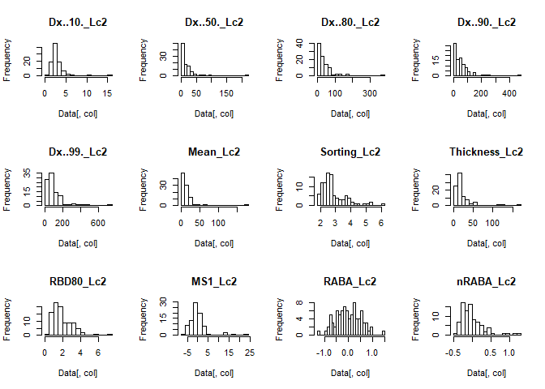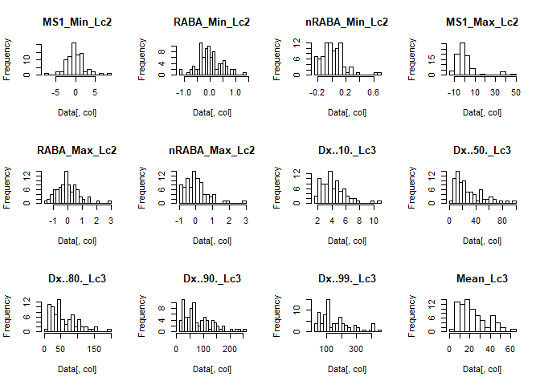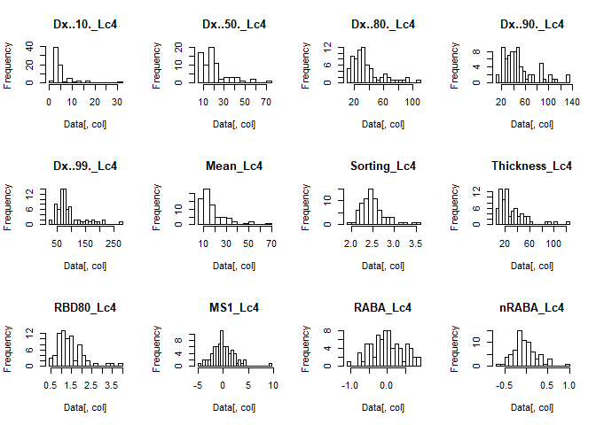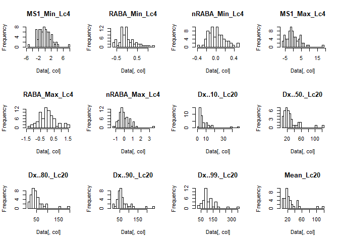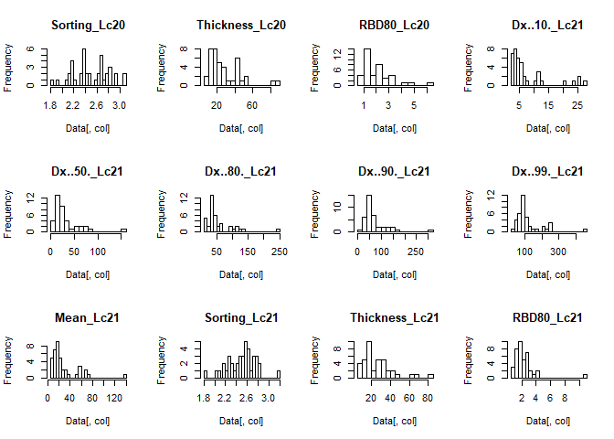

``` r
#check log transformed data
dat_log_check = Data
log_selection = grepl("Dx|D10|D90|D99|RBD80|Thickness|Mean|Sorting",
                      names(dat_log_check))
dat_log_check[,log_selection] = log(dat_log_check[,log_selection])
par(mfrow = c(3,4))
```

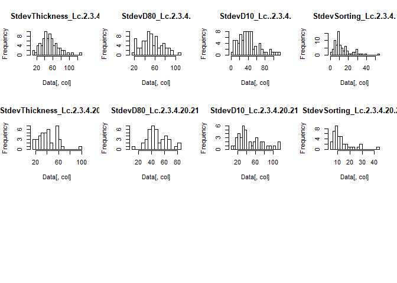

``` r
for (col in 3:ncol(dat_log_check)){
        hist(dat_log_check[,col],
             breaks = 20,
             main = paste("log",names(dat_log_check)[col]))
}
```

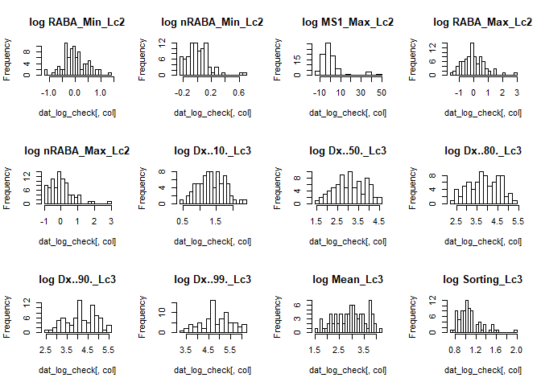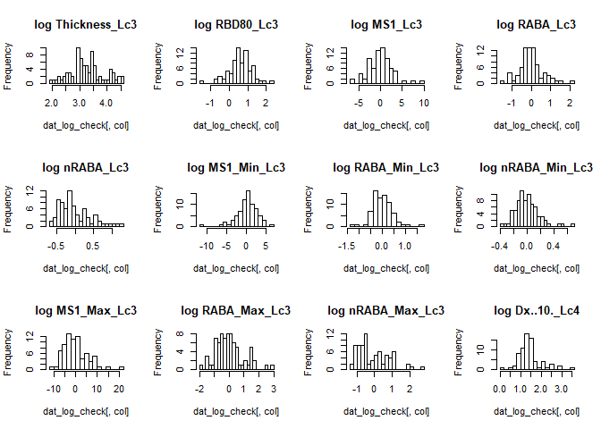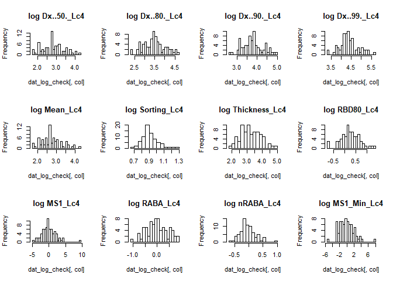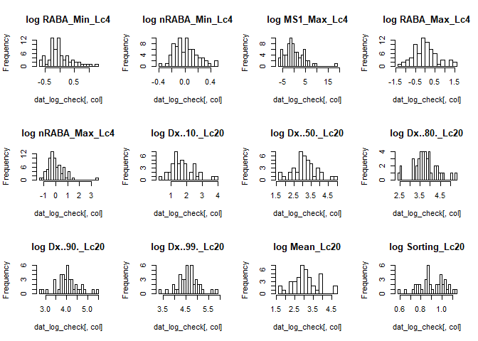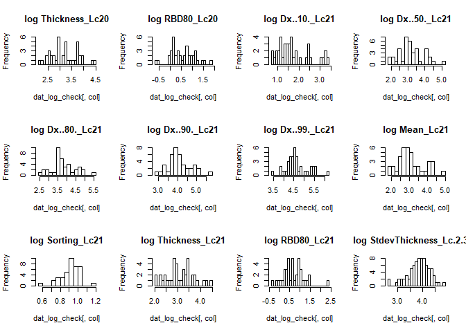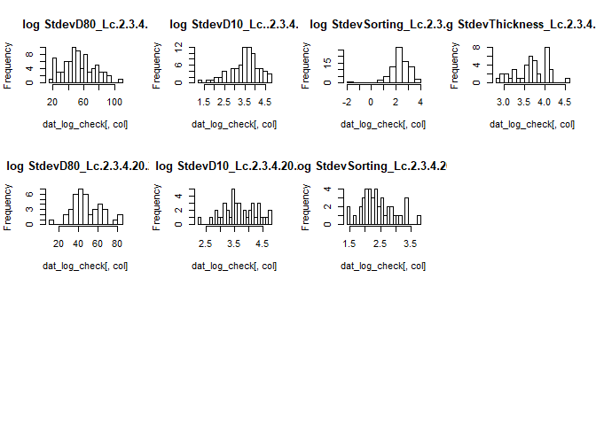

Subsets
=======

The presence of missing values in a dataset compiled by core data is
inevitable, as the maximum age of each composite core is usually
different. As the PCA cannot deal with this reality of missing values,
the complete dataset was divided in different selections.

``` r
# look for missing values
par(mfrow = c(1,1))
library(Amelia)
missmap(Data[,-1], main = "Missing values map", y.label = rev(Data$Turbidite),
        y.cex = 0.3, x.cex=  0.4, cex = 0.5)
```

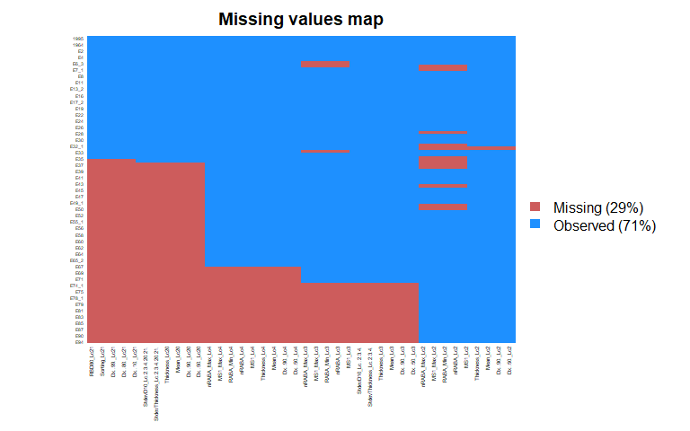

``` r
# define different slices of the table
slice_table = list()
slice_table[[1]] = list(name = "1a Do PCA for event 1995,1989,1964
                                and E1 to E36 over all locations",
                        by_row = TRUE,
                        by_col = FALSE,
                        rows = 1:40,
                        cols = NULL)

slice_table[[2]] = list(name = "1b Do PCA for event 1995,1989,1964
                                and E1 to E36 over all locations",
                        by_row = TRUE,
                        by_col = TRUE,
                        rows = c(1:40),
                        cols = grepl("Lc[2,3,4]|Turbidite|\\.2\\.3\\.4\\.",
                                     names(Data))&
                                !(grepl("Lc2($)",names(Data))&
                                grepl("(MS|RABA|nRABA)",names(Data))))

slice_table[[3]] = list(name = "1c Do PCA for event 1995,1989,1964
                                and E1 to E36 over all locations without
                                MS, RABA and nRABA of location 3",
                        by_row = TRUE,
                        by_col = TRUE,
                        rows = 1:40,
                        cols = !(grepl("Lc[3]$",names(Data))&
                               grepl("MS|RABA|nRABA",names(Data))))

slice_table[[4]] = list(name = "1d Do PCA for event 1995,1989,1964
                                and E1 to E36 over all locations without
                                MS, RABA and nRABA of location 2 and 3",
                        by_row = TRUE,
                        by_col = TRUE,
                        rows = 1:40,
                        cols = !(grepl("Lc[2,3]$",names(Data))&
                                grepl("MS|RABA|nRABA",names(Data))))

slice_table[[5]] = list(name = "1e Do PCA over 1995,1989,1964
                                and E1 to E36 for location 3, 4, 20, 21",
                        by_row = TRUE,
                        by_col = TRUE,
                        rows = 1:40,
                        cols =!(grepl("Lc[2]$",names(Data))))

slice_table[[6]] = list(name = "1f Do PCA for event 1995,1989,1964
                                and E1 to E36 over locations 2,3,4,20",
                        by_row = TRUE,
                        by_col = TRUE,
                        rows = c(1:40),
                        cols = grepl("Lc[2,3,4]($|0)|Turbidite|\\.2\\.3\\.4\\.",
                                     names(Data))&
                                !(grepl("Lc2($)",names(Data))&
                                grepl("(MS|RABA|nRABA)",names(Data))))

slice_table[[7]] = list(name = "2a Do PCA for event 1995,1989,1964
                                and E37 to E73 over locations 2,3,4",
                        by_row = TRUE,
                        by_col = TRUE,
                        rows = c(1:3,41:78),
                        cols = grepl("Lc[2,3,4]$|Turbidite|\\.2\\.3\\.4\\.$",
                                     names(Data)))

slice_table[[8]] = list(name = "2b Do PCA for event 1995,1989,1964
                                and E37 tot E73 over locations 2,3,4 without
                                MS, RABA and nRABA of location 2",
                        by_row = TRUE,
                        by_col = TRUE,
                        rows = c(1:3,41:78),
                        cols = grepl("Lc[2,3,4]$|Turbidite|\\.2\\.3\\.4\\.$",
                                     names(Data))&!
                                (grepl("Lc2$",names(Data))&
                                grepl("(MS|RABA|nRABA)",names(Data))))

slice_table[[9]] = list(name = "2c Do PCA for event 1995,1989,1964
                                and E37 to E73 over locations 2,3",
                        by_row = TRUE,
                        by_col = TRUE,
                        rows = c(1:3,41:78),
                        cols = grepl("Lc[2,3]$|Turbidite|\\.2\\.3\\.4\\.$",
                                     names(Data)))

slice_table[[10]] = list(name = "3a Do PCA for event 1995,1989,1964
                                and E74 to E94 over location 2",
                        by_row = TRUE,
                        by_col = TRUE,
                        rows = c(1:3,79:97),
                        cols = grepl("Lc[2]$|Turbidite|Aardbeving",
                                     names(Data)))


slice_table[[11]] = list(name = "3b Do PCA for event 1995,1989,1964
                                and E68 to E94 over location 2",
                        by_row = TRUE,
                        by_col = TRUE,
                        rows = c(1:3,74:97),
                        cols = grepl("Lc[2]$|Turbidite|Aardbeving",
                                     names(Data)))

slice_table[[12]] = list(name = "3c Do PCA for event 1995,1989,1964
                                and E61 to E94 over location 2",
                        by_row = TRUE,
                        by_col = TRUE,
                        rows = c(1:3,66:97),
                        cols = grepl("Lc[2]$|Turbidite|Aardbeving",
                                     names(Data)))
```

PCA & K-means clustering
========================

Principal component analysis was performed on the data in each subset to
investigate the variability in the multivariate dataset and to allow
visualisation. An initial normalisation was done in order to stabilize
the variance and limit the bias introduced by the different magnitudes
of the variables. In order to find two populations (earthquake or flood
turbidites) in the dataset, a k-means clustering (with k = 2) was
performed on the PCA scores. The k-means algorithms randomly pics
starting points and performs 100 iterations in order to find two optimal
clusters in the data. These clusters are assigned to flood or eartquake
deposits based on the classification of historic events. Code for
plotting the pca bi-plots with the assigned k-means cluster number is
included.

``` r
fig_list = list()
# FOR LOOP OVER DIFFERENT SELECTIONS
for(i in 1:length(slice_table)){
        #subset data frame
        print(slice_table[[i]]$name)
        if(slice_table[[i]]$by_col & slice_table[[i]]$by_row){
                slice = na.omit(Data[slice_table[[i]]$rows,slice_table[[i]]$cols])
                print(paste(slice_table[[i]]$name,"included events:"))
                print(slice$Turbidite)
                print(names(slice))
        }else if(slice_table[[i]]$by_col){
                slice = na.omit(Data[,slice_table[[i]]$cols])
                print(paste(slice_table[[i]]$name,"included events:"))
                print(slice$Turbidite)
                print(names(slice))
        }else if(slice_table[[i]]$by_row){
                slice = na.omit(Data[slice_table[[i]]$rows,])
                print(paste(slice_table[[i]]$name,"included events:"))
                print(slice$Turbidite)
                print(names(slice))
        }
        rownames(slice) = slice$Turbidite
        
        #create colorcoding for variables
        col_codes = names(slice[,-1])
        col_codes[grepl("RBD80", col_codes)] = "RBD80 Variables"
        col_codes[grepl("Dx|Mean|^Sorting", col_codes)] = "Grainsize Variables"
        col_codes[grepl("MS",col_codes)] = "Mag. Susc. Variables"
        col_codes[grepl("Stdev", col_codes)] = "Spatial Variables"
        col_codes[grepl("RABA",col_codes)] = "Spectral Variables"
        col_codes[grepl("Thickness", col_codes)] = "Thickness Variables"
        
        
        #define colors
        colors = c("#d7191c", "#045a8d")
        if("RBD80 Variables" %in% col_codes){colors = c(colors,"#e31a1c")}
        if("Grainsize Variables" %in% col_codes){colors = c(colors,"#ff7f00")}
        if("Mag. Susc. Variables" %in% col_codes){colors = c(colors,"#4daf4a")}
        if("Spatial Variables" %in% col_codes){colors = c(colors, "#2b83ba")}
        if("Spectral Variables" %in% col_codes){colors = c(colors,"#252525")}
        if("Thickness Variables" %in% col_codes){colors = c(colors,"#ae017e")}
        

        # Perform PCA
        ## first perform log transform of lognormally distributed data
        log_selection = grepl("Dx|D10|D99|RBD80|Thickness|Mean|Sorting",
                              names(slice))
        slice[,log_selection] = log(slice[,log_selection])
        
        ## run pca model
        pca = prcomp(slice[,-1], center = T, scale. = T)
        ## extract first 7 pc's is they are available
        slice_pca = as.data.frame(predict(pca))
        #select onlyc ertain pc's
        if(dim(slice_pca)[2] >= 7){slice_pca = slice_pca[,1:7]}
        
        # K-means on pca data

         set.seed(666)
         kmean_pca_random = kmeans(x = slice_pca,centers = 2,nstart = 100)
         # print(kmean_pca_random)
         cluster_pca_random = as.factor(as.vector(kmean_pca_random$cluster))
         center_pca_random = as.data.frame(kmean_pca_random$centers)
        
         
         txt = 8
         # create biplots
         g12_kmeans_pca_random = fviz_pca_biplot(pca, axes = c(1,2),
                                                 labelsize = 2,
                                                 pointsize = 1,
                                                 geom.ind = c("point","text"),
                                                 col.ind = cluster_pca_random,
                                                 geom.var = c("arrow", "text"),
                                                 col.var = col_codes,
                                                 alpha.var = 0.4,
                                                 palette = colors,
                                                 habillage = "none",
                                                 label = "ind",
                                                 title = NULL,
                                                 addEllipses = F,show.legend = F)+
                                      scale_fill_discrete(guide = FALSE)+
                 scale_shape_manual(values = c(17,15))+
                 guides(shape =  guide_legend("Events",
                                 title.position = "top",
                                 nrow = 3,
                                 override.aes = list(col = c("#d7191c",
                                                             "#045a8d"))),
                 col = guide_legend("Variable Classes",
                                    nrow = 3,
                                    title.position = "top",
                                    override.aes = list(bar = NA,
                                                        shape = NA,
                                                        fill=NA,
                                                        text = NA,
                                                        box =NA)))+
                theme(legend.direction = "horizontal",
                      legend.box = "horizontal",
                      text = element_text(size = 8),
                      legend.text = element_text(size = 8),
                      rect = element_rect(size = 0),
                      plot.margin = unit(c(0.2,0.2,0.2,0.2),"lines"))
         g13_kmeans_pca_random = fviz_pca_biplot(pca, axes = c(1,3),
                                                labelsize = 2,
                                                pointsize = 1,
                                                 geom.ind = c("point","text"),
                                                 col.ind = cluster_pca_random,
                                                 size.ind = 0.8,
                                                 geom.var = c("arrow", "text"),
                                                 size.var = 0.8,
                                                 col.var = col_codes,
                                                 alpha.var = 0.4,
                                                 palette = colors,
                                                 habillage = "none",
                                                 label = "ind",
                                                 title = NULL,
                                                 addEllipses = F,show.legend = F)+
                        scale_fill_discrete(guide = FALSE)+
                        scale_shape_manual(values = c(17,15))+
                        guides(shape =  guide_legend("Events",
                                        title.position = "top",
                                        nrow = 2,
                                        override.aes = list(col = c("#d7191c",
                                                                    "#045a8d"))),
                               col = guide_legend("Variable Classes",
                                     nrow = 3,
                                     title.position = "top",
                                     override.aes = list(shape = NA,
                                                         fill = NA)))+
                        theme(legend.direction = "horizontal",
                              legend.box = "horizontal",
                              text = element_text(size = 8),
                              legend.text = element_text(size = 8),
                              rect = element_rect(size = 0),
                              plot.margin = unit(c(0.2,0.2,0.2,0.2),"lines"))
         
         grid.arrange(grobs = list(ggplotGrob(g12_kmeans_pca_random+
                                              theme(legend.position = "none")),
                                  ggplotGrob(g13_kmeans_pca_random+
                                             theme(legend.position = "none")),
                                  g_legend(g13_kmeans_pca_random)),
                     nrow = 3,top =slice_table[[i]]$name)
         
         # add all to the figure list
         fig_list[[i]] = list(name = slice_table[[i]]$name,
                              pc12 = g12_kmeans_pca_random,
                              pc13 = g13_kmeans_pca_random)
        
}
```

``` r
#write relevant figures
aspect = 0.75
width = 4.72441
height = width/aspect
pdf("figures/fig1.pdf", width = width, height = height)
grid.arrange(grobs = list(ggplotGrob(fig_list[[1]]$pc12+theme(legend.position = "none")),
                          ggplotGrob(fig_list[[1]]$pc13+theme(legend.position = "none")),
                          g_legend(fig_list[[1]]$pc12)),
             heights = c(3/7,3/7,1/7),
             nrow = 3)
dev.off()
```

    ## png 
    ##   2

``` r
pdf("figures/fig2.pdf", width = width, height = height)
grid.arrange(grobs = list(ggplotGrob(fig_list[[7]]$pc12+theme(legend.position = "none")),
                          ggplotGrob(fig_list[[10]]$pc12+theme(legend.position = "none")),
                          g_legend(fig_list[[7]]$pc12)),
             heights = c(3/7,3/7,1/7),
             nrow = 3)
dev.off()
```

    ## png 
    ##   2

``` r
pdf("figures/fig4.pdf", width = width, height = height)
grid.arrange(grobs = list(ggplotGrob(fig_list[[2]]$pc12+theme(legend.position = "none")),
                          ggplotGrob(fig_list[[3]]$pc12+theme(legend.position = "none")),
                          g_legend(fig_list[[2]]$pc12)),
             heights = c(3/7,3/7,1/7),
             nrow = 3)
dev.off()
```

    ## png 
    ##   2

``` r
pdf("figures/fig6.pdf", width = width, height = height)
grid.arrange(grobs = list(ggplotGrob(fig_list[[8]]$pc12+theme(legend.position = "none")),
                          ggplotGrob(fig_list[[9]]$pc12+theme(legend.position = "none")),
                          g_legend(fig_list[[8]]$pc12)),
             heights = c(3/7,3/7,1/7),
             nrow = 3)
dev.off()
```

    ## png 
    ##   2

``` r
aspect = 0.52
width = 4.72441
height = width/aspect
pdf("figures/fig5.pdf", width = width, height = height)
grid.arrange(grobs = list(ggplotGrob(fig_list[[4]]$pc12+theme(legend.position = "none")),
                          ggplotGrob(fig_list[[5]]$pc12+theme(legend.position = "none")),
                          ggplotGrob(fig_list[[6]]$pc12+theme(legend.position = "none")),
                          g_legend(fig_list[[4]]$pc12)),
             heights = c(3/7,3/7,3/7,1/7),
             nrow = 4)
dev.off()
```

    ## png 
    ##   2

``` r
width = 6.69291
height = width
pdf("figures/fig5b.pdf", width = width, height = height)
grid.arrange(grobs = list(ggplotGrob(fig_list[[4]]$pc12+theme(legend.position = "none")),
                          ggplotGrob(fig_list[[5]]$pc12+theme(legend.position = "none")),
                          ggplotGrob(fig_list[[6]]$pc12+theme(legend.position = "none")),
                          g_legend(fig_list[[4]]$pc12)),
            nrow = 2)
dev.off()
```

    ## png 
    ##   2

``` r
width = 6.69291
height = 9.05512
pdf("figures/fig3.pdf", width = width, height = height)
grid.arrange(grobs = list(ggplotGrob(fig_list[[2]]$pc12+theme(legend.position = "none")),
                          ggplotGrob(fig_list[[3]]$pc12+theme(legend.position = "none")),
                          ggplotGrob(fig_list[[4]]$pc12+theme(legend.position = "none")),
                          ggplotGrob(fig_list[[5]]$pc12+theme(legend.position = "none")),
                          ggplotGrob(fig_list[[6]]$pc12+theme(legend.position = "none")),
                          g_legend(fig_list[[2]]$pc12),
                          ggplotGrob(fig_list[[8]]$pc12+theme(legend.position = "none")),
                          ggplotGrob(fig_list[[9]]$pc12+theme(legend.position = "none"))),
             nrow = 4)
dev.off()
```

    ## png 
    ##   2
